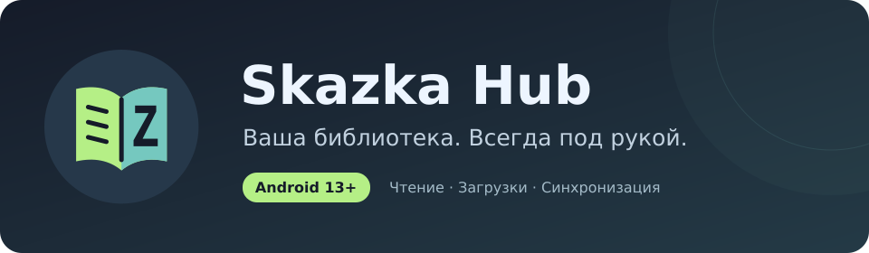

  

  
  
  

# Skazka Hub — releases / релизы

> **RU — основной язык · EN — обязательный второй язык**

## RU

### Текущий переходный релиз

**Skazka Hub 0.6.23-preview → 0.7.0-preview** переводит Android-приложение с legacy package `me.zaza.reader` на canonical package `com.kroxaboom.skazkahub` без автоматического удаления старой установки.

Для существующей установки:

1. Установите **0.6.23-preview** поверх **0.6.22-preview**.
2. В переходной версии откройте раздел миграции и установите проверенный **0.7.0-preview**.
3. При первом запуске 0.7.0 переносит библиотеку, прогресс, историю, настройки, IMAGE/TEXT/MIXED-контент, обложки и защищённые сессии.
4. Не удаляйте 0.6.23 до проверки данных в 0.7.0.

Для новой установки можно сразу использовать **0.7.0-preview** и выбрать чистый запуск.

### Почему в Latest две APK

Переходный release намеренно содержит обе версии:

- `SkazkaHub-0.6.23-preview.apk` — legacy package `me.zaza.reader`, `versionCode 29`;
- `SkazkaHub-0.7.0-preview.apk` — canonical package `com.kroxaboom.skazkahub`, `versionCode 29`.

`update.json` обслуживает старые установки, `update-canonical.json` — новый package, а `package-migration.json` используется переходной версией для безопасной установки canonical APK.

Обе APK подписаны одним доверенным сертификатом проекта. Минимальная версия Android — **13 / API 33**.

### Проверка

HOSTKEY SERVER-FIRST gate проверяет reproducible build, подпись, package/version/minSdk, rollback/retry, перенос локальных данных, canonical updater, RU/EN, Downloads и offline recovery. Старое приложение не удаляется автоматически.

---

## EN

### Current transition release

**Skazka Hub 0.6.23-preview → 0.7.0-preview** moves the Android app from legacy package `me.zaza.reader` to canonical package `com.kroxaboom.skazkahub` without automatically removing the old installation.

For an existing installation:

1. Install **0.6.23-preview** over **0.6.22-preview**.
2. Open the migration section in the transition build and install the verified **0.7.0-preview**.
3. On first launch, 0.7.0 migrates library data, progress, history, settings, IMAGE/TEXT/MIXED content, artwork, and protected sessions.
4. Keep 0.6.23 until the migrated data has been checked in 0.7.0.

New users can install **0.7.0-preview** directly and choose a fresh installation.

### Why Latest contains two APKs

The transition release intentionally contains both builds:

- `SkazkaHub-0.6.23-preview.apk` — legacy package `me.zaza.reader`, `versionCode 29`;
- `SkazkaHub-0.7.0-preview.apk` — canonical package `com.kroxaboom.skazkahub`, `versionCode 29`.

`update.json` serves legacy installations, `update-canonical.json` serves the canonical package, and `package-migration.json` is used by the transition build to install the verified canonical APK.

Both APKs use the same trusted project certificate. Minimum Android version: **13 / API 33**.

### Verification

The HOSTKEY SERVER-FIRST gate covers reproducible builds, signing, package/version/minSdk, rollback/retry, local data migration, the canonical updater, RU/EN, Downloads, and offline recovery. The old app is never removed automatically.

---

This public repository contains APK files, update metadata and RU/EN release documentation. Android source is maintained separately in the private `kroxaboom-sudo/skazka-hub` repository. Signing keys are never published.
